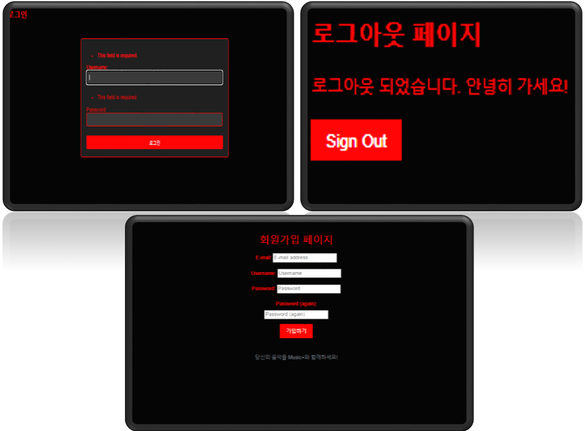

# Music + : 음악 시장의 혁신을 불러오다. 
##### 웹프로젝트 제작 : 음악에 관심 있는 사람들을 위한 웹페이지 제작
------------------------------------------------------------------------------------------------------------------------------------------------------------------------------------------------------------
## Index
#### 0. Background : 주제 선정에 영향을 준 컨텐츠
#### 1. What is Music+? : Music+란 무엇인가?
#### 2. Music+ : 우리 조가 만들어낸 웹 페이지
#### 3. Contents : 웹 페이지 구성 요소
------------------------------------------------------------------------------------------------------------------------------------------------------------------------------------------------------------

## 0. Background
- 1) 예술적인 창조력의 가능성을 발견
- 2) 새로운 기술의 음악성을 발견
- 3) 예술과 기술의 융합이 어떻게 세상을 변화시킬 수 있는가
- 4) 디지털 시대의 예술은 어떤 미래를 맞이할 것인가

------------------------------------------------------------------------------------------------------------------------------------------------------------------------------------------------------------

## 1. What is Music+?
- What is Music+? : Music+란 무엇일까?
- 1) Music+만의 로고 제작 : 음악에 추가하는 우리들의 창의성

- 2) 음악에 혁신을 더하다 : Music+가 가져올 수 있는 새로운 음악 웹페이지
- 3) 메인 컬러 : 흰색(백색 건반처럼 모든 음악의 기본 색) / 검은색(음악의 깊은 감정을 표현) / 빨간색(음악의 열정적이고 넘치는 에너지)

------------------------------------------------------------------------------------------------------------------------------------------------------------------------------------------------------------

## 2. Music+

- 1) 실시간 차트 : 국내 음원회사의 차트를 크롤링을 통해 연결
-- 우리의 웹페이지는 국내 음원회사의 차트를 크롤링을 통해 연결하여 제공합니다. 동적이고 풍부한 차트를 제공함으로써 사용자들에게 정보를 제공하여 음악 시장의 흐름을 분석할 수 있는 기회를 제공할 것입니다.

- 2) 내 음악리스트 만들기 : 나만의 음악을 추가하는 플레이리스트
-- 자신의 열정과 주관으로 사용자들은 음악 경험을 만들어갑니다. 직접 선정한 음악들은 각 사용자의 취향과 일상에 더욱 가깝게 다가가며 자신만의 음악 세계를 만들어 갈 것입니다.

- 3) 추천 음악 게시판 : 우리의 음악 커뮤니티
-- 사용자들이 소통하고 공유하는 공간인 추천음악 게시판은 우리의 웹페이지를 통해 형성된 음악 커뮤니티입니다. 각자가 추천하는 음악을 소개하고 토론할 수 있는 플랫폼으로, 우리가 만든 웹페이지의 가치를 높이고자 합니다.

- 4) 최신 음악 뉴스 : 직접 수집한 트렌드와 소식
-- 우리들은 음악 시장의 최신 트렌드와 뉴스를 주시하고 수집하여 제공합니다. 손수 모은 정보를 통해 사용자들에게 음악 흐름을 예측하고 소개함으로써, 우리의 웹페이지는 음악 팬들에게 독특하고 가치 있는 정보를 제공합니다.

------------------------------------------------------------------------------------------------------------------------------------------------------------------------------------------------------------

## 3. Content

- 1) Music+ Home
-- 웹페이지 홈 화면 : 로그인 및 회원가입 출력

- 2) Footer
-- 각 content 이동 및 이메일 구독 출력

- 3) Main1
-- Main페이지 중간에 위치하는 Recent posts

- 4) Main2
-- 실시간 멜론 차트의 Top7 출력

- 5) Realtime Chart
-- 실시간 차트를 크롤링하여 제공

- 6) Maker1 
-- 웹페이지 소개

- 7) Maker2
-- 웹페이지 개발자 소개

- 8) Music Recommendations
-- 추천음악 게시판. 사용자들이 자유롭게 포스트를 작성할 수 있으며 댓글로 소통할 수 있다

- 9) News
-- 음악 관련 뉴스 제공

 
- 10) 이상형월드컵
-- 이상형 월드컵이라는 타 사이트에서 제공하는 게임으로 통하는 드롭박스를 제공

- 11) Login / Logout / Sign up
-- 로그인페이지 / 로그아웃페이지 / 회원가입페이지

------------------------------------------------------------------------------------------------------------------------------------------------------------------------------------------------------------

